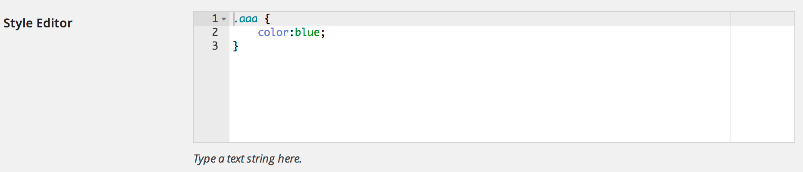

#AceCustomFieldType

An [Ace](http://ace.c9.io/) Custom Field Type for the [Admin Page Framework](https://github.com/michaeluno/admin-page-framework)



##Download
To clone AceCustomFieldType, including the `ace-builds` [submodule](https://github.com/ajaxorg/ace-builds), you need to use the git `--recursive` parameter: 

	git clone --recursive https://github.com/soderlind/AceCustomFieldType.git

If you forget to add the submodule, do


	git submodule init
	git submodule update


##Adding AceCustomFieldType

```php

class My_Settings extends AdminPageFramework {

    public function start_My_Settings() {

        if (! class_exists('AceCustomFieldType'))
            include_once(dirname( __FILE__ ) . '/AceCustomFieldType/AceCustomFieldType.php');

        $sClassName = get_class( $this );

        new AceCustomFieldType( $sClassName );
    }

    public function setUp() {

		/* add section etc */

        $this->addSettingFields(
            array(  // Ace Custom Field
                'field_id'         => 'style_editor',
                'section_id'       => 'a_section',
                'title'           => __('Style Editor', 'l10n' ),
                'description'     => __('Type a text string here.', 'l10n' ),
                'type'            => 'ace',
                'default'           => '',
                'attributes'    =>  array(
                    'rows'  =>  8,
                    'cols'  =>  85,
                ),
                'options'   => array(
        			'language'      			=> 'css',
        			'theme'         			=> 'chrome',
        		)
            )
        );
    }
}
```

##Changelog
* 0.0.1 Initial working release, there's still a lot todo

